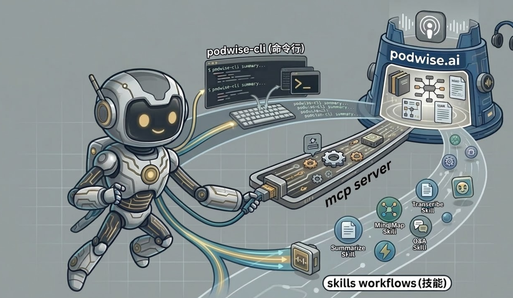

# podwise-cli



CLI client for [podwise.ai](https://podwise.ai) — turn any podcast episode into AI-powered insights, designed for use in AI agents and skills workflows.

Podwise transforms hours of podcasts into transcripts, summaries, outlines, Q&A, and mind maps. This CLI is purpose-built as a **tool for AI agents** — letting LLMs, skills runtimes, and automation pipelines fetch structured podcast insights without a browser or human in the loop.

- 🤖 Looking for ready-to-use agent skills? Jump to [Agent Skills](#agent-skills) →
- 🔌 Looking for mcp server? Jump to [MCP Server](#mcp-server) →

## Installation

#### Homebrew (macOS)

```bash
brew tap hardhackerlabs/podwise-tap
brew install podwise
```

#### Automatic Script

Run the following command to install the latest version of `podwise`:

```bash
curl -sL https://raw.githubusercontent.com/hardhackerlabs/podwise-cli/main/install.sh | sh
```

#### Manual (Binary)

1. Download the latest binary for your OS and architecture from [GitHub Releases](https://github.com/hardhackerlabs/podwise-cli/releases).
2. Unpack the archive (e.g., `tar -xzf podwise_linux_amd64.tar.gz`).
3. Move the `podwise` binary to a directory in your PATH, for example:
   ```bash
   mv podwise /usr/local/bin/
   ```
4. Make sure it's executable: `chmod +x /usr/local/bin/podwise`.

#### From Source

If you have Go installed, you can build and install the binary directly from the source:

```bash
git clone https://github.com/hardhackerlabs/podwise-cli.git
cd podwise-cli
go build -o podwise .
# Move the binary to a directory in your PATH, e.g.,
sudo mv podwise /usr/local/bin/
```

## Configuration

First, create your [podwise.ai](https://podwise.ai/dashboard/settings) API key:

```bash
# Set your API key
podwise config set api_key your-sk-xxxx

# Verify connection
podwise config show
```

The configuration is stored at `~/.config/podwise/config.toml`.

## Usage

You can search for podcast episodes or process specific episodes to get summaries and transcripts.

#### Search Episodes

```bash
# Search episodes by title keywords
podwise search "Hard Fork"
podwise search episode "machine learning" --limit 20

# Search podcasts by name
podwise search podcast "Lex Fridman"
```

#### Process an Episode

```bash
# Podwise episode URL (Recommended)
podwise process https://podwise.ai/dashboard/episodes/7360326

# 小宇宙 episode URL 
podwise process https://www.xiaoyuzhoufm.com/episode/abc123

# Youtube video URL
podwise process https://www.youtube.com/watch?v=d0-Gn_Bxf8s
podwise process https://youtu.be/d0-Gn_Bxf8s`,
```

#### Trending Episodes

```bash
podwise popular
```

#### Ask AI

```bash
# Ask a question answered from podcast transcripts
podwise ask "the future of AI Agents"
podwise ask "How does retrieval augmented generation work?" --sources
```

#### Get Episode Details

```bash
# Get summary
podwise get summary https://podwise.ai/dashboard/episodes/7360326

# Get transcript
podwise get transcript <episode-url>
```

For more details on all available commands and flags, run:
```bash
podwise --help
```

## Agent Skills

> **Prerequisites:** Before installing skills, make sure you have completed the [Installation](#installation) and [Configuration](#configuration) steps above — the `podwise` CLI must be installed and your `api_key` must be set.

Podwise provides official agent skills out of the box. Run the following command to install the latest skills into your current directory:

```bash
curl -sL https://raw.githubusercontent.com/hardhackerlabs/podwise-cli/main/install-skills.sh | sh
```

You can also build your own skills on top of the `podwise` CLI to create custom workflows that fit your needs.

## MCP Server

Podwise exposes all its capabilities as an [MCP (Model Context Protocol)](https://modelcontextprotocol.io) server, allowing AI assistants (Gemini CLI, Claude Desktop, Cursor, etc.) to search episodes, process media, and retrieve AI-generated content directly as tools.

Start the MCP server (communicates over stdin/stdout):

```bash
podwise mcp
```

The server exposes the following tools:

| Tool                     | Description                                                                    |
| ------------------------ | ------------------------------------------------------------------------------ |
| `search_episode`         | Search for podcast episodes by title keywords                                  |
| `search_podcast`         | Search for podcasts by name                                                    |
| `popular`                | List current trending/popular podcast episodes                                 |
| `process`                | Submit a YouTube / 小宇宙 / Podwise URL or local file for AI processing        |
| `get_transcript`         | Fetch the full transcript (text / SRT / VTT)                                   |
| `get_summary`            | Fetch the AI-generated summary and key takeaways                               |
| `get_qa`                 | Fetch AI-extracted Q&A pairs                                                   |
| `get_chapters`           | Fetch the chapter breakdown with timestamps                                    |
| `get_mindmap`            | Fetch the AI-generated mind map                                                |
| `get_highlights`         | Fetch notable highlights with timestamps                                       |
| `get_keywords`           | Fetch topic keywords with descriptions                                         |
| `ask`                    | Ask the AI a question answered from podcast transcripts                        |
| `drill`                  | List recent episodes for a specific podcast by its Podwise URL                 |
| `follow`                 | Follow a podcast by its Podwise URL (idempotent)                               |
| `unfollow`               | Unfollow a podcast by its Podwise URL (idempotent)                             |
| `list_followed_episodes` | List recent episodes from podcasts you follow, filterable by date or day range |
| `list_followed_podcasts` | List followed podcasts with new episodes, filterable by date or day range      |

#### Install

1. Make sure `podwise` is installed and configured (see [Installation](#installation) and [Configuration](#configuration)).

2. Add the following to your settings file:

```json
{
  "mcpServers": {
    "podwise": {
      "command": "podwise",
      "args": ["mcp"]
    }
  }
}
```